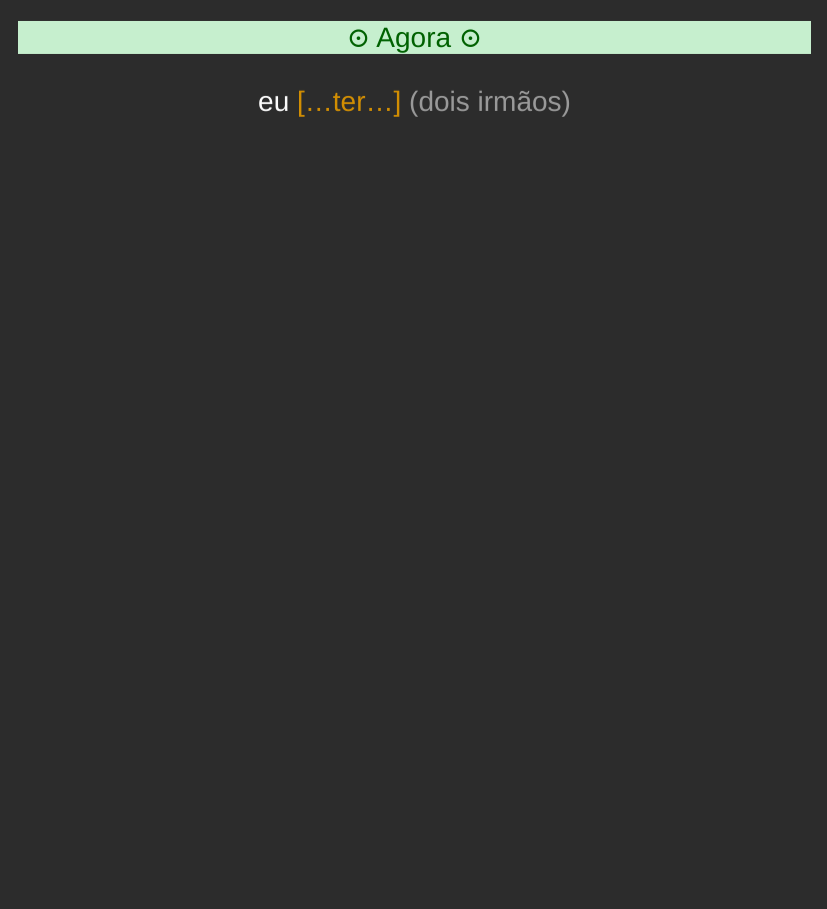
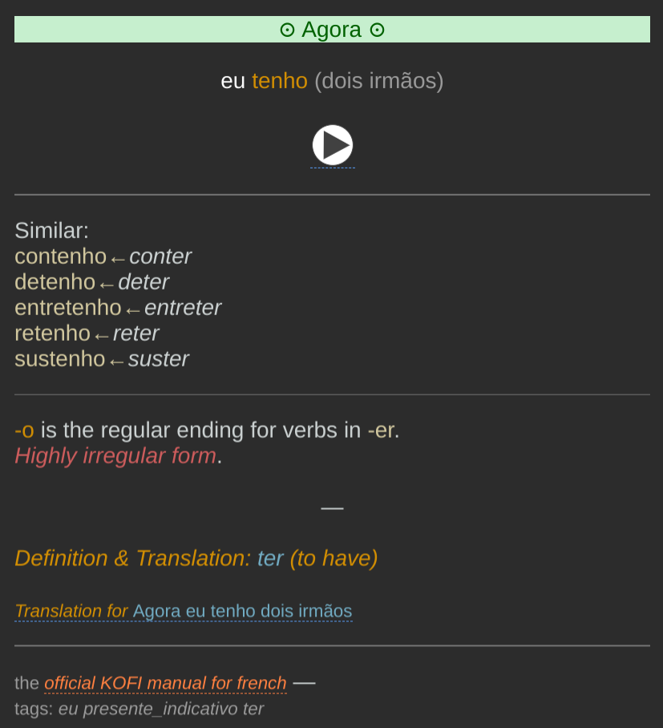

> [!NOTE]
> This repository uses AI-generated code. The Portuguese deck has been validated
> for the most part but some card prompts might not sound natural to native
> speakers and must still be refined.

# What is KOFI

**KOFIISH** is based on the **KOFI** language-learning method developed by
Andy. He describes his method like this:

> **KOFI** (**Ko**njugation **Fi**rst) is the name I've given to a provocative
> language-learning approach I've created: to learn **all** the forms of a
> language's conjugation before even starting to formally study the language.

You can find more information on his website:
 - [French](https://www.asiteaboutnothing.net/w_kofi-french.php)
 - Italian (link does not resolve)
 - [Spanish](https://www.asiteaboutnothing.net/w_ultimate_spanish_conjugation.php)

# KOFIISH

**KOFIISH** is a tool to create [Anki](https://apps.ankiweb.net/) decks based
on his methodology, but it's not an official KOFI deck: it is only KOFI-*ish*.

Here is what the front side of a card looks like:



The card has a few sections:
  - the tense cue: a visual symbol and a text on a colored background.
  - on the next line, the pronoun with the verb to conjugate and a sentence fragment to give more sense

The backside when revealed:



There are a few more fields:
  - audio media (if present)
  - similar verbs, to show other verbs using the same pattern
  - notes, to give more context and help generalize what could be learned from
    a card (for instance that `-o` is the regular ending for verbs in `-er`)
  - verb translation and link to translation for the whole sentence


## Philosophy of KOFIISH

I really liked the KOFI idea and wanted to adapt it to Portuguese. I especially
like that:
  - there is a visual cue (symbol and color) for each tense
  - verbs are used with a tiny bit of context
  - verbs of the same family are also shown (that's extra vocabulary)
  - there are notes giving more context

But there were a few things I wanted to change:
  - notes sometimes showed the "hypothetical regular form" of irregular verbs;
    I don't think showing invalid forms really helps
  - notes are sometimes plain useless ("#25 in the deck out of 59 dissonant verb", not sure what this information is for)
  - the pronunciation (for the French deck) is an external link. Portuguese
    pronunciation can be challenging, so I wanted to have audio in the cards to
    avoid having to exit the deck

With that in mind, the general idea was to create a tool to transform some
inputs (YAML files, Anki card templates and style, media files) and convert
them into an Anki deck that can be imported by Anki-compatible applications.

I wanted to keep YAML files for verb definitions as the ultimate source of
truth because it is very hard to get it right by code only, and I did not want
to take the risk of fixing one verb by breaking another one. Every verb form
and context can be overridden individually.


# Usage

Create the Portuguese deck:

```sh
uv run kofiish build pt
```

Show verb `ter` from the Portuguese deck:

```sh
uv run kofiish show pt ter
```

`show` accepts a few options:
  - `--tense <tense_name>` to limit the output to a tense (e.g. `--tense presente_indicativo`)
  - `--person <person>` to limit the output to a single person (e.g. `--person 1sg`)
  - `--include-context` to show the sentence as it would appear on a card
  - `--include-analogs` to show analog verbs (if present)
  - `--include-audio` to show each form's expected audio file and whether it was found
  - `--format anki` to export the selected forms as an Anki package instead
    (written to `--output`, or `kofiish_<deck>_<verb>.apkg` by default)


# Anatomy Of A Deck

As an example, here is how the Portuguese deck is composed:

```
decks/
└── pt
    ├── assets
    │   ├── back-template       # back of the card
    │   ├── front-template      # front of the card
    │   └── styling             # Card CSS
    ├── deck.yaml               # Deck entry point
    ├── media                   # media files (audio)
    │   ├── estar
    │   └── ...
    ├── transformations         # transformations to create conjugated forms
    │   ├── conjugator_ar.py
    │   └── ...
    └── verbs                   # list of verbs to include in the deck
        ├── chamar.yaml
        └── ...
```

## deck.yaml

This file is the main entry point and is what the tool looks for
when the different commands are run. There are several sections:

**metadata**: pretty self-explanatory. Just note that the IDs must be unique
and stable in order to make re-import of newer versions of the deck easier.
When creating decks for another language, make sure to use other IDs.

**verbs**: lists all the verbs to include in the deck. When a verb is listed,
this tool expects that a file under `decks/<language>/verbs/` has a matching
`metadata:lemma` value. More on that in the verb section.

**pronouns**: lists the pronouns to use for the different conjugations. Keys
in this section are free-form; they are referenced by the tense definitions
(see next point). They _can_ contain a `prompt` and a `tag`. The prompt is
shown on cards.

**tenses**: lists the different tenses that compose the deck. Each tense name
is defined by its key and is a dictionary that contains all the **forms** that
compose it, and a visual **cue**. The **cue** is shown on cards to help in the
learning process by anchoring a tense with a visual reference.

## \<verb\>.yaml

Each of these files is the definition of a verb.

**metadata**: dictionary with `lemma` and `translation`.

**transformations**: lists all the transformations that will be applied to this
verb to create the conjugated forms.

**tenses**: gives extra context for each tense. Each tense is composed of:
  - `context`: dictionary with `cue` and `hint`. A card basically looks like:
    `<cue> <pronoun> <verb to guess> <hint>`.
  - `forms`: dictionary that allows overriding some forms if they could not be
    generated correctly by a transformation.
  - `notes`: notes to add to give extra context to the user.

## Audio

Cards can include audio if a corresponding media file is found. Use the `show`
command with `--include-audio` to show the expected filename. Files must be in
`decks/<language>/media/<verb>/<file>.mp3`.

> [!NOTE]
> Only `ter`, `ser`, `haver`, `fazer`, and `estar` have audio files. These audio files
> were generated via text-to-speech to see how it would work in the deck and
> how they would sound, and the result is not always optimal.
> Ideally, I would prefer recordings of a native speaker.
